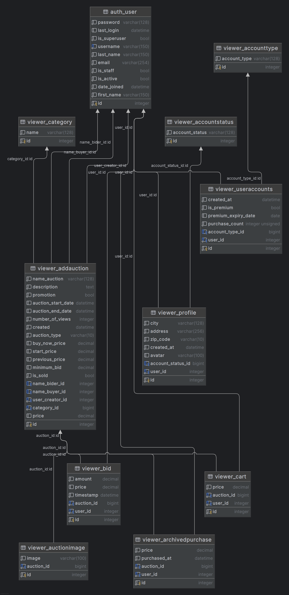

# Auction gallery:
Projekt aukční webové stránky, tématem je Aukční gallerie - obrazy, sochy, mince a šperky, něco mezi aukro.cz a galerieumeni.cz - podle zadání kurzu Pythonu u SDA Academy: "Projektem je vytvoření systému sloužícího k pořádání aukcí a přihazování na jednotlivé položky. Kromě toho systém umožňuje uživatelům zakládat vlastní účty a vyhodnocovat transakce."
pozn. Projekt není plně dokončen.

# Spouštění aplikace:
- pip install -r requirements.txt
- python manage.py makemigrations
- python manage.py migrate
- python manage.py runscript populate_date -v3
- python manage.py runserver
- admin - jméno/heslo: 1234/1234

# Auction gallery - průběžné body:
- [ ] opravit zobrazování detailů účtů
- [ ] zkontrolovat nebo dodělat rankování účtů
- [ ] dodělat search
- [ ] udělat logiku prémium účtů s opětovnou platbou
- [ ] překopat zobrazení promotion a without promotion aukcí
- [x] počet kliknutí nefunguje
- [X] přidání volného řádku u kartičky, protože se zkracovala
- [x] přidání, aby šlo klikat na celou kartičku aukce - nejde klikat na úplný konec kartičky
- [x] oprava None zobrazování ceny u nově přidaných aukcí
- [x] sjetí na konec stránky po přidání příhozu
- [x] javascript u detailu stránky zobrazí aktuální výši příhozu
- [x] pri prihlaseni umoznit uzivateli, aby si upravil profil
- [x] testovat, testovat, testovat
- [x] pokud dám nižší než minimální příhoz, nezobrazí se žádné upozornění
- [X] zelené buy now rozbijí logiku nákupu u již skončených aukcí, jde je přidat do košíku
- [x] je potřeba fixnout zobrazení vícero obrázků u aukce, aby to jelo konzistentně
- [x] fix populační dat, aby správně ukazovaly příhozy
- [x] někam se vytratila přeškrknutá cena z Place bid
- [x] aby nešlo vytvářet aukci nepřihlášeným uživatelem
- [x] opravit, aby nešla dát částka pod minimální příhoz
- [x] users list a detail uživatelů
- [ ] opravit detailní hledání - chybí description, a otestovat ho - neotestované
- [X] napojit Androjovu větev s koupí na to co již máme a udělat pomyslný nákup s tím, že se daná aukce odebere ze seznamu akcí
- [x] dodělat koupení produktu a vzájemné vyhodnocení kupující/prodávající
- [x] finalized - testy
- [x] finalized - populační data
- [x] finalized - přepsat veškeré texty do angličtiny
- [x] finalized - upravit veškeré kódy do finální podoby přes code cosi
- [x] finalized - odstranit z html kódu poznámky
- [x] finalized - upravit a popsat .py soubory, zejména views, vyházet co není potřeba v models.py - ještě to projít
- [x] opravit názvy tříd
- [x] přejmenovat záložku Authors na Prodávající/kupující
- [x] administrace vytvořených účtů, vytvoření adresy, aby šlo měnit adresu
- [x] - vyvořit 3-4 testy - ještě to zkorigovat
- [X] vytvořit premium ucet a napárovat to s promotions kategoriemi
- [x] zapracovat auction_list do 4 kategorií a do archivovaných aukcí
- [x] zajistit, aby nešlo přispívat/kupovat u již archivovaných aukcí
- [x] nejde mi rozjet routa cart_view
- [x] nefunguje Back to Add Auctions - návrat z detailu aukce
- [x] stránka přidání nových aukcí nezobrazuje poslední přidané aukce
- [x] pokazilo se vyhledávání
- [x] někde se pokazilo přihazování na detailu aukce
- [X] pokazila se add_auction_add stránka, tak ji opravit - jedeme už add_action_form
- [X] CRUD - přejmenovat add, protože hlásilo chybu - nevím kde to Andrejovi hlásilo chybu, u mě všechno OK
- [x] buy now - u kup teď odstranit přidávání příhozů
- [x] login-log out tlačítko
- [x] přidat obrázky k přihlášení/odhlášení a registraci - nejde dát obrázek k logout
- [x] posunout menu doleva
- [x] ukázat kolik zbývá času do konce aukce
- [x] na stránce probíhající akce udělat forcyklus přidaných příhozů
- [ ] pořešit hlavy soch
- [x] přidat, aby šlo přidávat vícero obrázku k jedné aukci
- [x] pokazily se obrázky velkých kategorií, tak to opravit
- [X] přidat odkazy na jednotlivýcg stránkách a přidat forcyklus na stránky podle kategorie
- [X] potřebovali bychom předělat models - sloučit Auction a Advertisement, možná i hodnocení aukce
- [x] udělat košík a koupi produktu
- [x] udělat hodnocení nákupu - prodávající/kupující
- [x] vytvořit uživatelské účty
- [x] registrace/přihlášení/odhlášení
- [x] rozjet stránky na rosti.cz
- [x] administrace účtů - 3 typy účtů - createsuperuser/promotion/běžný účet
- [x] předělat CRUD - aby zobrazoval add_auction
- [x] přepsat advertisement na add_auction
- [x] oddělat z hlavní stránky probíhající aukce a dát tam je obrázky s odkazem na další stránky
- [x] udělat jednu stránku probíhající aukce
- [x] zprovoznit .js velkého obrázku
- [x] přidat okdaz kup teď u kup teď aukcí
- [x] barevně zvýraznit promotion a kup teď
- [x] CRUD - dodělat zbylých 10%, aby fungoval - nefunguje delete a neprojeví se změny úprav
- [x] hledej - přidat usera
- [x] zfunkčnit odkazy pod názvem Aukční galerie
- [x] zfunčnit Obrazy-Numismatika obrázky přes obrázky a Zobrazit
- [x] udělat logo
- [x] udělat favicon
- [x] dát hledej napravo od loga
- [x] změnit barvu modré na hnědou v base.html
- [x] dát menu Home až Contact do hamburgeru
- [x] udělat podrobné hledání
- [x] opětovně zprovoznit photo v models.py
- [x] fixnout advertisement.html, aby zobrazoval příspěvky v řádku a následně ve sloupci
- [x] vytvoření populační dat
- [x] vytvoření hlavní stránky - buy_now, promotion, no_promotion 
- [x] vytvoření oddělovače tisíce - tečky, tj. např. 1.309 Kč
- [x] home stránka
- [x] vkládání nabídky
- [x] přehled aukcí např. 10
- [ ] návrh od konzultanta, pouze na zvážení - volba měny, lupička na přiblížení detailu malby, šperku, sochy; forma dodání, faktura, dodání kam - fakturační adresa stejná jako místo dodání, osobní odběr, jestli je to na firmu, takže IČO a DIČO, možnost platby - převodem, paypal, kartou, při doručení, připojištění zásilky, možnost osobní prohlídky po dobou aukce, možnost konzultace ohledně ceny díla, kontaktní adresy, děláme něco mezi aukrem a galerií umění, jak je ošetřené kurátory štengrování při falešné bidování, doklad o pravosti díla za příplatek

# ER Diagram
